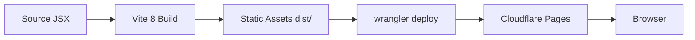
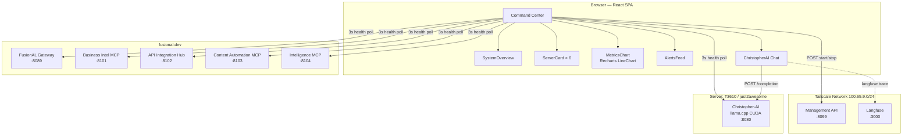

# FusionAL Command Center — Architecture

## Overview

FusionAL Command Center is a **single-page application (SPA)** that serves as the operational dashboard for the FusionAL infrastructure. It provides real-time health monitoring, service management (start/stop), and an integrated chat interface to the local llama.cpp-powered AI assistant (Christopher-AI).

| Attribute | Value |
|---|---|
| **Type** | Client-side SPA (Cloudflare Pages) |
| **Framework** | React 19 (hooks-based) |
| **Build** | Vite 8 + @cloudflare/vite-plugin |
| **Runtime** | Browser (no Node.js server) |
| **Deployment** | `wrangler deploy` → Cloudflare Pages |

---

## Project Structure

```
FusionAL-Command-Center/
├── index.html                 # SPA entry point
├── package.json               # Dependencies & scripts
├── vite.config.js             # Vite build config (React + Cloudflare)
├── eslint.config.js           # ESLint flat config
├── wrangler.jsonc             # Cloudflare Pages/Workers config
├── src/
│   ├── main.jsx               # React root mount
│   └── App.jsx                # Single-component application (975 lines)
└── docs/
    └── ARCHITECTURE.md        # This file
```

### Source Files (5)

| File | Purpose |
|---|---|
| `index.html` | HTML shell with `<div id="root">` — no server-side rendering |
| `src/main.jsx` | Bootstrap: `createRoot` renders `<App />` in StrictMode |
| `src/App.jsx` | **Entire application** — state, styles, all components in one file |
| `vite.config.js` | Vite plugins: `@vitejs/plugin-react` + `@cloudflare/vite-plugin` |
| `eslint.config.js` | Linting rules: recommended JS + React hooks + Refresh |

---

## Build & Deployment Pipeline



- **`vite build`** produces static files in `dist/`.
- **`wrangler deploy`** publishes to Cloudflare Pages.
- `wrangler.jsonc` configures SPA fallback (`not_found_handling: "single-page-application"`) so all routes serve `index.html`.
- `nodejs_compat` compatibility flag is enabled.

---

## Runtime Architecture

All logic runs in the **browser** with a single React component tree. There is no server-side backend — the dashboard communicates directly with two infrastructure endpoints over HTTP.



### Data Flow

1. **Health Polling** — Every 3 seconds, `runHealthChecks()` fires `fetch()` to all 6 service `/health` endpoints simultaneously via `Promise.all`. Results update service state cards, the metrics chart, and the event log.
2. **Service Control** — Start/Stop buttons POST to the Management API (`:8099/start/<key>` / `:8099/stop/<key>`), which runs the actual process commands on the infrastructure.
3. **Christopher-AI Chat** — User messages are sent as llama.cpp-compatible completions (`POST /completion` with Llama chat template formatting). Responses stream in via the same request (non-streaming mode).
4. **Observability** — Langfuse SDK traces every AI chat interaction, sending telemetry to a self-hosted Langfuse instance on the Tailscale network.

---

## Components

### `SystemOverview`
Four summary cards showing aggregate stats: total services, online count, average latency, and health check status. Receives `servers` state array as prop.

### `ServerCard` (×6)
Displays a single microservice's status with:
- Name, subdomain, port
- Status pill (online/offline/warning/checking)
- Latency (ms) with color-coded thresholds (<100 green, <300 yellow, ≥300 red)
- HTTP status code
- **Start / Stop buttons** (conditionally enabled based on current state)

### `MetricsChart`
A Recharts `LineChart` with two series:
- **Avg Latency (ms)** — derived from health check round-trip times
- **Online** — count of healthy services

Data window: last 30 data points (90 seconds at 3s intervals).

### `AlertsFeed`
A reverse-chronological event log. Alerts are generated when a service transitions between states (online→offline, offline→online, etc.). Capped at 20 entries. Each entry has a type (error/warning/info/success), message, timestamp, and service name.

### `ChristopherAI`
A chat panel composing:
- **Chat area** — message bubbles with user/assistant distinction
- **Input** — text field + Send button (Enter to submit)
- **Config sidebar** — editable endpoint URL, system prompt, connection test button
- **Model info** — shows health response data or static stack info (whisper.cpp, llama.cpp CUDA, Piper TTS)
- **Langfuse tracing** — wraps each completion in a `trace.generation()` block for observability

---

## Monitored Services

| Key | Name | Subdomain | Port |
|---|---|---|---|
| `gateway` | FusionAL Gateway | gateway.fusional.dev | 8089 |
| `bi-mcp` | Business Intelligence MCP | bi.fusional.dev | 8101 |
| `api-hub` | API Integration Hub | api.fusional.dev | 8102 |
| `content-mcp` | Content Automation MCP | content.fusional.dev | 8103 |
| `intel-mcp` | Intelligence MCP | intel.fusional.dev | 8104 |
| `christopher-ai` | Christopher-AI (llama.cpp) | christopher.fusional.dev | 8080 |

All services are polled via `https://<subdomain>/health`. The Management API and Langfuse run on the same Tailscale node (`100.65.9.40`) and are not exposed via public DNS.

---

## Infrastructure Dependencies

| Dependency | Purpose | Location |
|---|---|---|
| **Cloudflare Pages** | Hosting / CDN | Cloudflare edge |
| **Tailscale** | Private network overlay | `100.65.9.0/24` |
| **Management API** | Service start/stop orchestration | `100.65.9.40:8099` |
| **Langfuse** | AI observability & tracing | `100.65.9.40:3000` |
| **Christopher-AI (llama.cpp)** | Local LLM inference (CUDA, Llama 3.2 3B Q4_K_M) | T3610:8080 |
| **whisper.cpp** | Speech-to-text (ASR) | T3610 |
| **Piper TTS** | Text-to-speech | T3610 |

---

## Environment

- **Runtime**: Browser only
- **Required env var**: `CLOUDFLARE_API_TOKEN` (for wrangler deploy authentication)
- **Network**: Services must be reachable from the browser (either public DNS or Tailscale MagicDNS + funnel)

---

## Known Limitations

- All components live in a single file (`App.jsx`) — no component decomposition into separate modules yet.
- No TypeScript — plain JSX throughout.
- No authentication/authorization on the dashboard itself.
- Start/Stop POSTs have no confirmation dialog and silently swallow errors (re-poll recovers state).
- Health check uses `no-cors` mode, which returns `opaque` responses (status code is lost for cross-origin endpoints).
- The `langfuse` secret key is hardcoded (redacted placeholder) — should be injected at build time via env vars.
- Langfuse instance is on a Tailscale-only IP; from a browser outside the Tailscale network, Langfuse tracing will fail silently.
